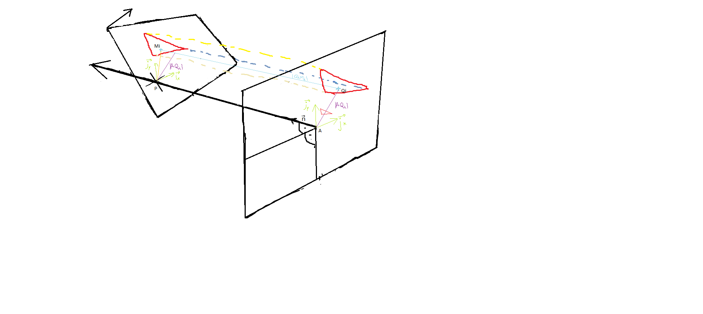
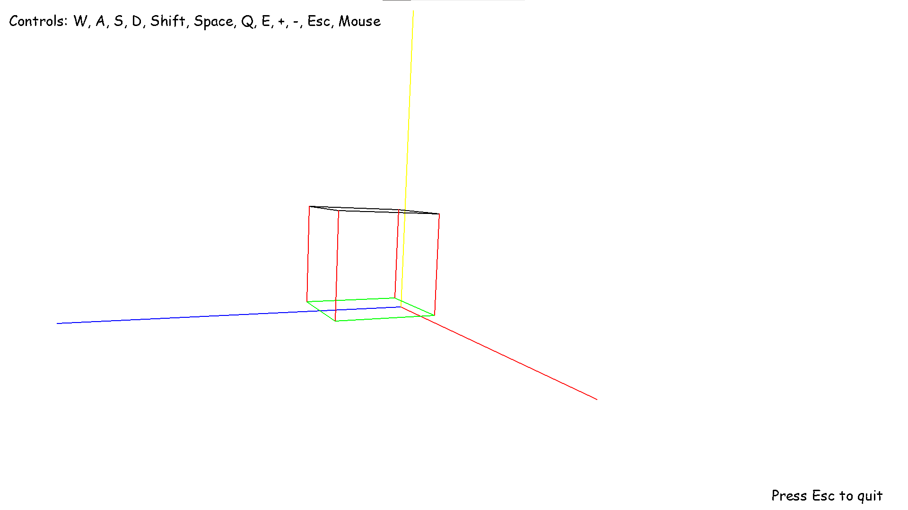
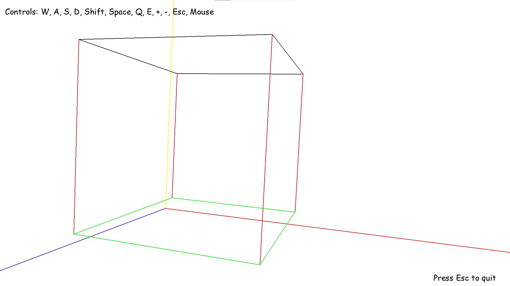

# 3D-engine

This is an old high school project. I was experimenting with drawing and I was wandering whether I could create a 3D engine with just high school math. It turns out it's possible. Of course it's not optimized at all. I just wanted to create a 3D engine. (made in 2018)

You can easily add new shapes and also animations but I just created 1 cube back then. I also wanted to make the shapes have solid walls with colors but this turned out to be out of my league because I sucked at math (relatively said).

## Requirements
 - Python 3
 - pygame
 - probably only runnable on Windows

## Credits
- [Tomáš Žilínek](https://www.linkedin.com/in/tomaszilinek)

